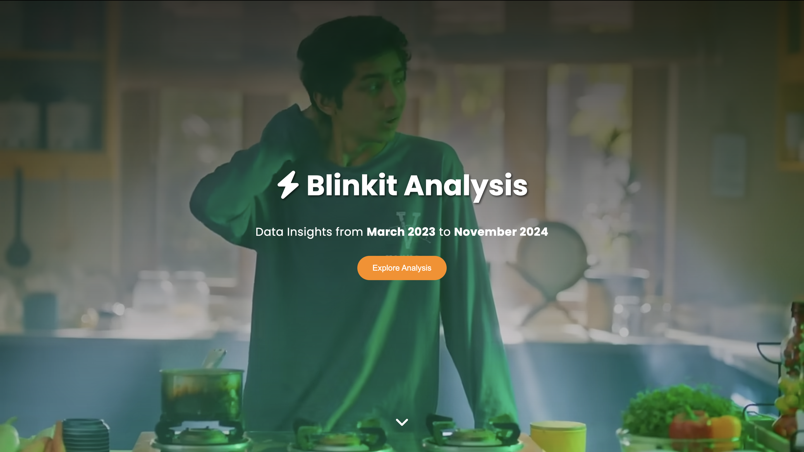
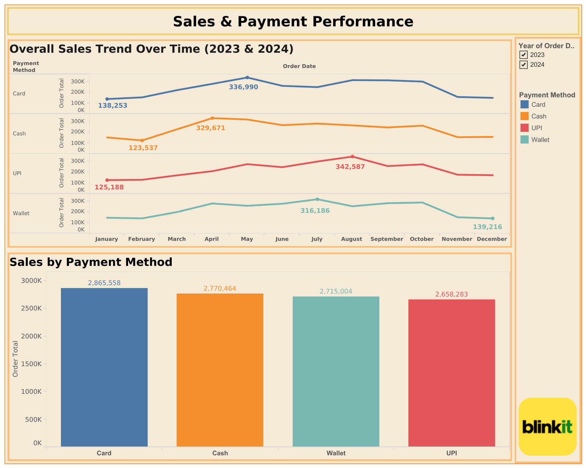
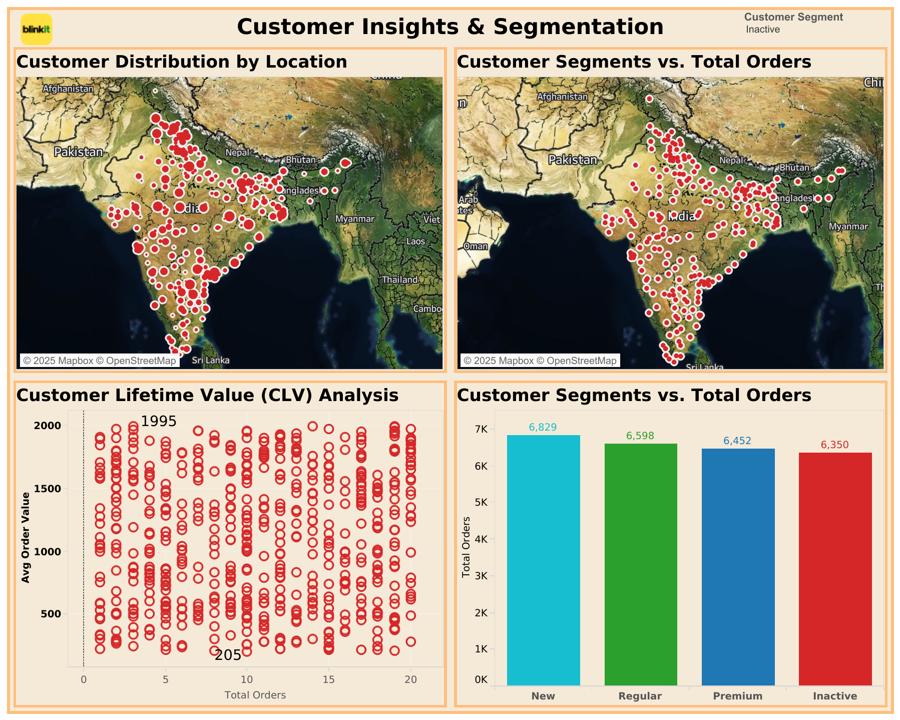
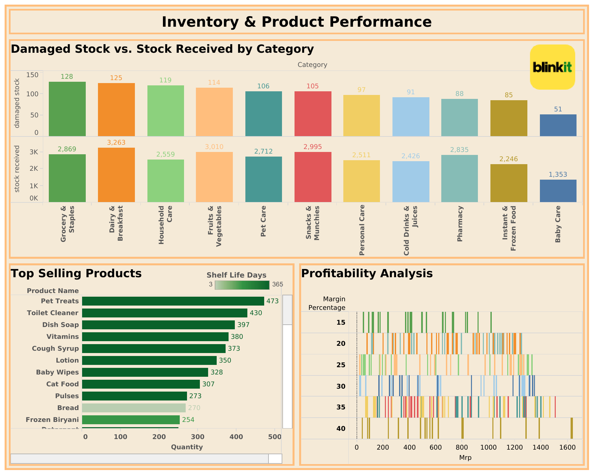
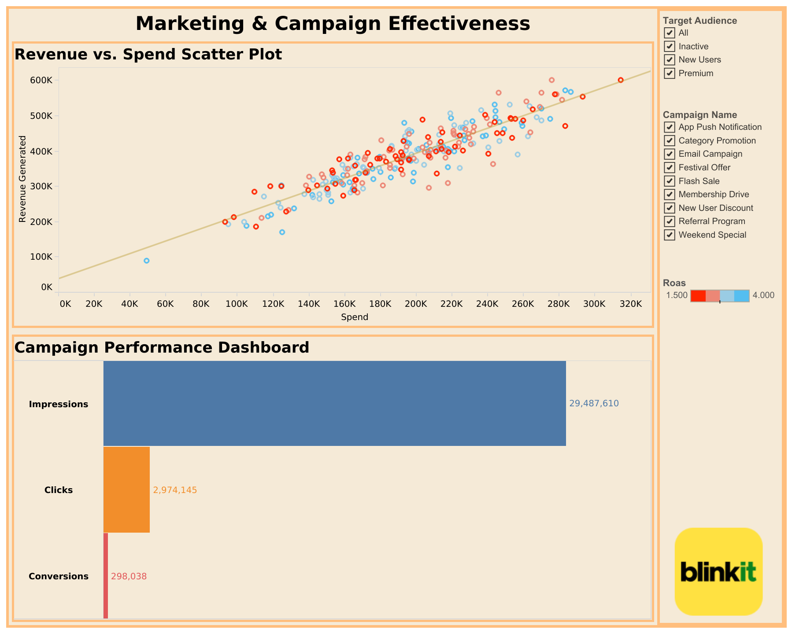

# Blinkit Data Analysis Dashboard 📊

<div align="center">

[](https://tanishq-ctrl.github.io/blinkit-analysis/)

<h3>A comprehensive data storytelling dashboard analyzing Blinkit's performance metrics</h3>

[View Live Dashboard](https://tanishq-ctrl.github.io/blinkit-analysis/) • [Report Bug](https://github.com/tanishq-ctrl/blinkit-analysis/issues) • [Request Feature](https://github.com/tanishq-ctrl/blinkit-analysis/issues)

</div>

## 📸 Dashboard Preview

<div align="center">
  
</div>

### Interactive Visualizations

<div align="center">
  
  
</div>

<div align="center">
  
  
</div>

<div align="center">
  
  
</div>

---

## 🎯 Project Overview

An in-depth analysis of Blinkit's business metrics from March 2023 to November 2024, covering:
- 📈 Sales & Payment Analytics
- 👥 Customer Behavior
- 🚚 Delivery Performance
- 📦 Inventory Management
- 📱 Marketing Campaigns
- ❤️ Customer Sentiment

## ⚡ Key Features

- 📊 Interactive Tableau Visualizations
- 📱 Mobile-Responsive Design
- 🔄 Real-time Data Updates
- 📈 Comprehensive Analytics
- 🎨 Animated Transitions
- 📝 Detailed Insights

## 📊 Analysis Highlights

<details>
<summary><b>💳 Payment Trends</b></summary>

| Payment Method | 2024 (₹) | 2023 (₹) | Growth |
|---------------|----------|-----------|--------|
| Card | 1,466,181 | 1,399,377 | +4.77% |
| Cash | 1,423,947 | 1,346,517 | +5.74% |
| Wallet | 1,336,965 | 1,378,039 | -2.98% |
| UPI | 1,317,458 | 1,340,825 | -1.75% |

</details>

<details>
<summary><b>👥 Customer Segments</b></summary>

| Segment | Orders | Key Characteristics |
|---------|--------|-------------------|
| New | 6,829 | First-time buyers |
| Regular | 6,598 | Consistent purchasers |
| Premium | 6,452 | High-value customers |
| Inactive | 6,350 | Dormant accounts |

</details>

<details>
<summary><b>🚚 Delivery Performance</b></summary>

| Metric | Value | Details |
|--------|-------|---------|
| On-time Deliveries | 1,577 | Within promised time |
| Slight Delays | 529 | 5-10 minutes late |
| Significant Delays | 136 | >15 minutes late |
| Average Time | 3.92-5.40 min | Delivery duration |

</details>

<details>
<summary><b>📦 Inventory Analysis</b></summary>

### Margin Performance
- 🥇 Instant & Frozen Food: 40%
- 🥈 Pet Care: 35%
- 🥈 Personal Care: 35%
- 🥈 Snacks & Munchies: 35%

### Damage Rates
- Household Care: 4.65%
- Grocery & Staples: 4.46%
- Dairy & Breakfast: 3.83%

</details>

<details>
<summary><b>📱 Marketing ROI</b></summary>

| Campaign Type | ROAS |
|--------------|------|
| Festival Offers | 4.00 |
| Email Campaigns | 3.92 |
| Category Promotions | 3.89 |
| Weekend Special | 2.98 |

</details>

<details>
<summary><b>❤️ Customer Satisfaction</b></summary>

### Overall Rating: 3.35/5

| Rating | Customers | Percentage |
|--------|-----------|------------|
| ⭐⭐⭐⭐⭐ | 816 | 16.3% |
| ⭐⭐⭐⭐ | 1,708 | 34.2% |
| ⭐⭐⭐ | 1,398 | 28.0% |
| ⭐⭐ | 538 | 10.8% |
| ⭐ | 540 | 10.8% |

### Service Performance
- 🚚 Delivery: 85% positive
- 📱 Mobile App: 82% positive
- 🛍️ Product: 82% satisfied
- 🎧 Support: 75% positive

</details>

## 💻 Tech Stack


## 🚀 Quick Start

```bash
# Clone the repository
git clone https://github.com/tanishq-ctrl/blinkit-analysis.git

# Navigate to project directory
cd blinkit-analysis

# Open in browser
open index.html
```

## 🤝 Contributing

1. Fork the Project
2. Create your Feature Branch (`git checkout -b feature/AmazingFeature`)
3. Commit your Changes (`git commit -m 'Add some AmazingFeature'`)
4. Push to the Branch (`git push origin feature/AmazingFeature`)
5. Open a Pull Request

## 📄 License

This project is licensed under the MIT License - see the [LICENSE](LICENSE) file for details.

[](https://opensource.org/licenses/MIT)

## 👨‍💻 Author

<div align="center">
  <a href="https://github.com/tanishq-ctrl">
    
  </a>
  <a href="https://www.linkedin.com/in/tanishq-prabhu-b71467166/">
    
  </a>
</div>

<div align="center">
  <sub>Built with ❤️ by <a href="https://github.com/tanishq-ctrl">Tanishq Prabhu</a></sub>
</div>
